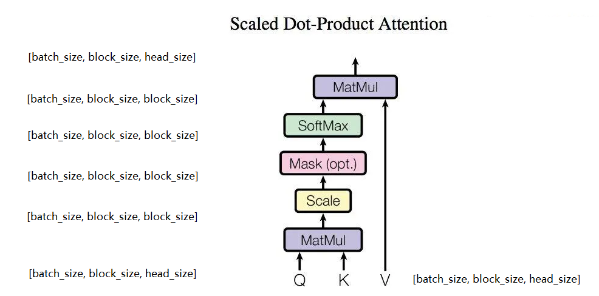

# 实验2

## part1 传统机器学习

### 贝叶斯网络手写数字识别

#### 实验原理

根据下面的公式，利用朴素贝叶斯实现手写数字识别

$$
P(Y|F_{i,j} \quad i,j \in [0,27]) \propto P(Y) {\textstyle \prod_{i,j=0}^{27}} P(F_{i,j}|Y)
$$

为了计算 $P(Y|F_{i,j} \quad i,j \in [0,27])$ ，需要在模型训练时算出 $P(Y)$ 和 $P(F_{i,j}|Y)$

#### 代码实现

计算 $P(Y)$

```python
        for i in range(self.n_labels):
            self.labels_prior[i] = np.sum(labels == i) / n_samples
```

计算 $P(F_{i,j}|Y)$

```python
        for i in range(self.n_pixels):
            for j in range(self.n_values):
                for k in range(self.n_labels):
                    self.pixels_cond_label[i][j][k] = np.sum((pixels[:, i] == j) & (labels == k)) / np.sum(labels == k)
```

计算 $P(Y|F_{i,j} \quad i,j \in [0,27])$

```python
        for i in range(n_samples):
            p = np.zeros(self.n_labels)
            for j in range(self.n_labels):
                p[j] = self.labels_prior[j]
                for k in range(self.n_pixels):
                    p[j] *= self.pixels_cond_label[k][pixels[i][k]][j]
```

预测最终的标签 $lable = {argmax}_y P(Y = y|F_{i,j} \quad i,j \in [0,27])$

```python
labels[i] = np.argmax(p)
```

#### 测试集准确率

```
test score: 0.843800
```

### 利用 **K-means** 实现图片压缩

#### 实验原理

K-means 算法的伪代码如下

```
1) 创建k个点作为K个簇的起始中心

2) 当任意一个点的簇分配结果发生变化时
	a.对数据集中的每个数据点，将数据点分配到距其最近的簇
	b.对每个簇，计算簇中所有点的均值并将均值作为新的中心
```

利用 K-means 算法将图像中的像素点在 RGB 空间中进行聚类，聚类后用簇中心点的像素值替换簇中的像素值

#### 代码实现

对数据集中的每个数据点，将数据点分配到距其最近的簇

```python
        dis = np.linalg.norm(points[:, np.newaxis, :] - centers, axis=2)
        labels = np.argmin(dis, axis=1)
```

对每个簇，计算簇中所有点的均值并将均值作为新的中心

```python
centers = np.array([points[labels == i].mean(axis=0) for i in range(self.k)])
```

K-means 算法，在这里不考虑是否分配结果变化，直接循环 max_iter 次

```python
        centers = self.initialize_centers(points)
        for i in range(self.max_iter):
            labels = self.assign_points(centers, points)
            centers = self.update_centers(centers, labels, points)
        return centers
```

用簇中心点的像素值替换簇中的像素值

```python
        centers = self.fit(points)
        labels = self.assign_points(centers, points)
        points = centers[labels]
```

#### 不同参数的压缩结果

k = 2


k = 4 


k = 8


k = 16


k = 32


## part2 深度学习

### 实验原理

#### transformer

​	transformer 的基本结构如下所示


​	由于实验只需要完成通过当前的句子预测下一个词的任务，因此不需要 cross attention ，可以只保留 Decoder 的结构同时删去 Multi-Head Attention，得到如下的网络结构

#### embedding

##### tokenizer

​	在 inputs 输入 input embedding 之前，首先对 inputs 进行编码，直接对所有的英文字母（a-z）进行 tokenize 化

##### position embedding

​	使用 absolute position embedding，使模型能够记住输入的每个token的位置

$$
\left\{\begin{array}{l}
P E(\text { pos, } 2 i)=\sin \left(\text { pos } / 10000^{2 i / d_{\text {model }}}\right) \\
P E(\operatorname{pos}, 2 i+1)=\cos \left(\text { pos } / 10000^{2 i / d_{\text {model }}}\right)
\end{array}\right.
$$


#### attention

​	注意力机制是 transformer 的一部分。在每个编码或者解码步骤中，它决定哪些输入部分更重要。在 self-attention 中虽然一次性接收所有 token，每个 token 可以查看输入句子中的所有 token，但我们一次生成一个 token：在生成过程中，我们不知道将来会生成哪些 token。所以，为了禁止解码器向前看，该模型使用了掩蔽的自注意力：未来的 token 被掩蔽掉了。因为我们无法知道未来发生什么。

​	计算 attention output 的公式如下：


​	对应的 attention 网络结构如下，其中 Mask 将输入不包含对角线的上三角部分置为负无穷，从而让这部分在 softmax 层后变为0


​	通常，理解一个词在句子中的作用需要理解它与句子不同部分的关系。这不仅对处理输入的源句很重要，对生成目标句也很重要。例如，在某些语言中，主语定义动词变形，动词定义宾语的大小写，等等。即：每个词都是许多关系的一部分。

​	因此，我们必须让模型关注同一个词的不同的关系：这就是 Multi-Head Attention 背后的动机。多头注意力不是只有一个注意力机制，而是有几个独立工作的“头”。

​	利用 Self-Attention 组成 Multi-Head Attention 的结构如下


#### add & norm

​	add & norm 层保证梯度能够在层间传递的过程中不会消失


#### feedforward

​	除了 attention 之外，block 模块中一个前馈神经网络（feedforward network），它由两层线性层以及之间的 ReLU 激活函数组成，形式化的表述如下：

$$
FFN(x) = \max(0,xW_1+b_1)W_2+b_2
$$

​	如何理解在 attention 之后加入 FFN 呢，一种比较直观的解释是：attention 的作用在于观察其他 token 并且收集其信息，而 FFN 的作用在于思考并且处理这些信息。


### 代码实现

#### transformer

​	在  `__init__(*self*)` 中定义各层网络

```python
        self.embedding = nn.Embedding(num_embeddings=n_vocab, embedding_dim=n_embd)
        self.position_encoding = get_position_encoding(self, block_size)
        self.blocks = nn.ModuleList([Block(n_embd, n_heads) for _ in range(n_layers)])
        self.linear = nn.Linear(n_embd, n_vocab)
        self.softmax = nn.Softmax(dim=-1)
```

​	在 `forward(*self*, *inputs*, *labels*=None)` 中将 inputs 用逐层神经网络处理得到最终的概率分布

```python
        batch, time = inputs.shape
        embedding = self.embedding(inputs) + self.position_encoding[:time, :].unsqueeze(0)
        for block in self.blocks:
            embedding = block(embedding)
        logits = self.linear(embedding)
        probs = self.softmax(logits)
```

​	在 `generate(*self*, *inputs*, *max_new_tokens*)` 中循环生成结果，当句子超过 block_size 时进行截断，输出时根据概率进行采样

```python
        out = inputs
        for _ in range(max_new_tokens):
            # generates new tokens by iteratively sampling from the model's predicted probability distribution, 
            # concatenating the sampled tokens to the input sequence, and returning the updated sequence.
            batch, time = inputs.shape
            embedding = self.embedding(inputs) + self.position_encoding[:time, :].unsqueeze(0)
            for block in self.blocks:
                embedding = block(embedding)
            logits = self.linear(embedding[:, -1, :])
            probs = self.softmax(logits)
            next_token = torch.multinomial(probs, num_samples=1)
            # next_token = torch.argmax(probs, dim=-1).unsqueeze(1)
            out = torch.cat((out, next_token), dim=1)
            inputs = out[:, -block_size:]
        inputs = out
```

#### embedding

##### tokenizer

​	将字符直接映射到整数上，整数的范围为[0，n_vocab - 1]

```python
class char_tokenizer:
    """
    a very simple char-based tokenizer. the tokenizer turns a string into a list of integers.
    """

    def __init__(self, corpus: List[str]):
        self.corpus = corpus
        # TODO: calculate the vocab size and create a dictionary that maps each character to a unique integer
        self.dic = {char: i for i, char in enumerate(corpus)}
        self.n_vocab = len(corpus)
        # End of your code

    def encode(self, string: str):
        # TODO: convert a string into a list of integers and return, using the dictionary you created above
        return [self.dic[char] for char in string]
        # End of your code

    def decode(self, codes: List[int]):
        # TODO: convert a list of integers into a string and return, using the dictionary you created above
        return ''.join([self.corpus[code] for code in codes])
        # End of your code
```

##### position embedding

​	利用三角函数进行位置编码

```python
        def get_position_encoding(self, n_position):
            position = torch.arange(n_position).unsqueeze(1)
            div_term = torch.exp(torch.arange(0, n_embd, 2) * -(math.log(10000.0) / n_embd))
            pos_encoding = torch.zeros((n_position, n_embd))
            pos_encoding[:, 0::2] = torch.sin(position * div_term)
            pos_encoding[:, 1::2] = torch.cos(position * div_term)
            return pos_encoding.to(device)
```

#### attention

​	在 Head 的 `__init__(self, head_size)` 中定义三个线性映射层，分别用于映射 Key Query Value，然后定义一个 softmax 层

​	在 Head 的 `forward(self, inputs)` 按照实验原理中的结构将 inputs 逐层用网络进行处理，其中用 triu 将不包含对角线的上三角覆盖为极大的负数 -1e9 再用 softmax 层处理

```python
class Head(nn.Module):
    """single head of self-attention"""

    def __init__(self, head_size):
        super().__init__()
        # TODO: create three linear layers, Key, Query, and Value, each of which maps from n_embd to head_size
        #       and assign them to self.Key, self.Query, and self.Value, respectively
        self.Key = nn.Linear(n_embd, head_size)
        self.Query = nn.Linear(n_embd, head_size)
        self.Value = nn.Linear(n_embd, head_size)
        self.softmax = nn.Softmax(dim=-1)
        self.register_buffer("triu", torch.triu(torch.ones(block_size, block_size), diagonal=1).bool())
        # End of your code
        self.register_buffer("tril", torch.tril(torch.ones(block_size, block_size)))

    def forward(self, inputs):
        # TODO: implement the forward function of the head
        #       the input is a tensor of shape (batch, time, n_embd)
        #       the output should be a tensor of shape (batch, time, head_size)
        #       you may use the tril buffer defined above to mask out the upper triangular part of the affinity matrix
        Q = self.Query(inputs)
        K = self.Key(inputs)
        V = self.Value(inputs)
        dot_products = torch.bmm(Q, K.transpose(1, 2)) / torch.sqrt(torch.tensor(K.shape[-1], dtype=torch.float32))
        dot_products = dot_products.masked_fill(self.triu[:inputs.shape[1], :inputs.shape[1]], -1e9)
        dot_products = self.softmax(dot_products)
        out = torch.bmm(dot_products, V)
        # End of your code
        return out
```

​	在 MultiHeadAttention 定义多个头和投影层，将输入经过多个头后连接再投影，保持与输入相同的维度

```python
class MultiHeadAttention(nn.Module):
    def __init__(self, n_heads, head_size):
        super().__init__()
        #TODO: implement heads and projection
        self.heads = nn.ModuleList([Head(head_size) for _ in range(n_heads)])
        self.projection = nn.Linear(n_heads * head_size, n_embd)
        # End of your code

    def forward(self, inputs):
        #TODO: implement the forward function of the multi-head attention
        heads_outputs = [head(inputs) for head in self.heads]
        out = torch.cat(heads_outputs, dim=-1)
        return self.projection(out)
```

#### add & norm

​	使用 `nn.LayerNorm(n_embd)` 定义

#### feedforward

​	使用 nn.Sequential 定义三层结构，线性层-RELU层-线性层

```python
class FeedForward(nn.Module):
    def __init__(self, n_embd):
        super().__init__()
        #TODO: implement the feed-forward network
        self.net = nn.Sequential(nn.Linear(n_embd, 4 * n_embd), nn.ReLU(), nn.Linear(4 * n_embd, n_embd))
        # End of your code

    def forward(self, inputs):
        return self.net(inputs)
```

#### block

​	在 Block 中定义多头、add & norm、feedforward层，将输入数据逐层处理

```python
class Block(nn.Module):
    def __init__(self, n_embd, n_heads):
        super().__init__()
        # TODO: implement the block of transformer using the MultiHeadAttention and 
        # FeedForward modules, along with the layer normalization layers
        self.self_attention = MultiHeadAttention(n_heads, n_embd // n_heads)
        self.feed_forward = FeedForward(n_embd)
        self.layer_norm1 = nn.LayerNorm(n_embd)
        self.layer_norm2 = nn.LayerNorm(n_embd)
        # End of your code
    def forward(self, inputs):
        #TODO: implement the forward function of the block, you may refer to the docs of this experiment
        attention_out = self.self_attention(inputs)
        norm1_out = self.layer_norm1(inputs + attention_out)
        forward_out = self.feed_forward(norm1_out)
        inputs = self.layer_norm2(norm1_out + forward_out)
        # End of your code
        return inputs
```

### 输入经过各层网络的维度变化





### 模型训练

模型训练 5000次 的 Loss 图 如下所示，其中每个 iteration 为 50 step


```bash
step 0: train loss 4.4061, val loss 4.4070
step 49: train loss 2.6835, val loss 2.7020
step 99: train loss 2.5498, val loss 2.5594
step 149: train loss 2.5070, val loss 2.5161
step 199: train loss 2.4802, val loss 2.4953
step 249: train loss 2.4490, val loss 2.4776
step 299: train loss 2.4206, val loss 2.4476
step 349: train loss 2.3598, val loss 2.3752
step 399: train loss 2.3055, val loss 2.3316
step 449: train loss 2.2718, val loss 2.2910
step 499: train loss 2.2305, val loss 2.2564
step 549: train loss 2.1938, val loss 2.2340
step 599: train loss 2.1603, val loss 2.2146
step 649: train loss 2.1189, val loss 2.1856
step 699: train loss 2.0804, val loss 2.1453
step 749: train loss 2.0357, val loss 2.1136
step 799: train loss 1.9930, val loss 2.0833
step 849: train loss 1.9571, val loss 2.0512
step 899: train loss 1.9330, val loss 2.0398
step 949: train loss 1.8946, val loss 2.0018
step 999: train loss 1.8611, val loss 1.9937
step 1049: train loss 1.8452, val loss 1.9676
step 1099: train loss 1.8278, val loss 1.9614
step 1149: train loss 1.8016, val loss 1.9546
step 1199: train loss 1.7751, val loss 1.9201
step 1249: train loss 1.7547, val loss 1.9009
step 1299: train loss 1.7519, val loss 1.8926
step 1349: train loss 1.7252, val loss 1.8830
step 1399: train loss 1.7199, val loss 1.8637
step 1449: train loss 1.7053, val loss 1.8699
step 1499: train loss 1.6809, val loss 1.8590
step 1549: train loss 1.6790, val loss 1.8525
step 1599: train loss 1.6612, val loss 1.8435
step 1649: train loss 1.6649, val loss 1.8454
step 1699: train loss 1.6462, val loss 1.8115
step 1749: train loss 1.6341, val loss 1.8009
step 1799: train loss 1.6245, val loss 1.8050
step 1849: train loss 1.6275, val loss 1.7975
step 1899: train loss 1.6069, val loss 1.7839
step 1949: train loss 1.5975, val loss 1.7899
step 1999: train loss 1.5950, val loss 1.7700
step 2049: train loss 1.5850, val loss 1.7678
step 2099: train loss 1.5863, val loss 1.7737
step 2149: train loss 1.5731, val loss 1.7627
step 2199: train loss 1.5680, val loss 1.7711
step 2249: train loss 1.5639, val loss 1.7616
step 2299: train loss 1.5624, val loss 1.7448
step 2349: train loss 1.5542, val loss 1.7483
step 2399: train loss 1.5519, val loss 1.7325
step 2449: train loss 1.5350, val loss 1.7348
step 2499: train loss 1.5384, val loss 1.7368
step 2549: train loss 1.5338, val loss 1.7324
step 2599: train loss 1.5296, val loss 1.7357
step 2649: train loss 1.5336, val loss 1.7361
step 2699: train loss 1.5145, val loss 1.7073
step 2749: train loss 1.5089, val loss 1.7191
step 2799: train loss 1.5088, val loss 1.7112
step 2849: train loss 1.5027, val loss 1.7020
step 2899: train loss 1.5018, val loss 1.7113
step 2949: train loss 1.5026, val loss 1.7052
step 2999: train loss 1.4905, val loss 1.6974
step 3049: train loss 1.4887, val loss 1.6964
step 3099: train loss 1.4896, val loss 1.6924
step 3149: train loss 1.4859, val loss 1.6998
step 3199: train loss 1.4837, val loss 1.6955
step 3249: train loss 1.4790, val loss 1.6809
step 3299: train loss 1.4709, val loss 1.6790
step 3349: train loss 1.4710, val loss 1.6821
step 3399: train loss 1.4694, val loss 1.6763
step 3449: train loss 1.4623, val loss 1.6884
step 3499: train loss 1.4722, val loss 1.6898
step 3549: train loss 1.4580, val loss 1.6740
step 3599: train loss 1.4592, val loss 1.6684
step 3649: train loss 1.4562, val loss 1.6704
step 3699: train loss 1.4492, val loss 1.6691
step 3749: train loss 1.4465, val loss 1.6596
step 3799: train loss 1.4533, val loss 1.6697
step 3849: train loss 1.4428, val loss 1.6532
step 3899: train loss 1.4463, val loss 1.6643
step 3949: train loss 1.4378, val loss 1.6474
step 3999: train loss 1.4323, val loss 1.6533
step 4049: train loss 1.4360, val loss 1.6455
step 4099: train loss 1.4366, val loss 1.6601
step 4149: train loss 1.4375, val loss 1.6437
step 4199: train loss 1.4314, val loss 1.6284
step 4249: train loss 1.4334, val loss 1.6399
step 4299: train loss 1.4283, val loss 1.6505
step 4349: train loss 1.4252, val loss 1.6428
step 4399: train loss 1.4189, val loss 1.6372
step 4449: train loss 1.4202, val loss 1.6509
step 4499: train loss 1.4189, val loss 1.6354
step 4549: train loss 1.4144, val loss 1.6524
step 4599: train loss 1.4155, val loss 1.6515
step 4649: train loss 1.4165, val loss 1.6305
step 4699: train loss 1.4058, val loss 1.6444
step 4749: train loss 1.4164, val loss 1.6371
step 4799: train loss 1.4110, val loss 1.6532
step 4849: train loss 1.4019, val loss 1.6319
step 4899: train loss 1.4043, val loss 1.6494
step 4949: train loss 1.3978, val loss 1.6303
step 4999: train loss 1.4054, val loss 1.6405
100%|██████████████████████████████████████████████████████████████████████████████████████████████████████████████████| 5000/5000 [30:15<00:00,  2.75it/s]

As if you apprown belam, Rike kin.
I came them off the Vienaz wind that.

JULIET:
Well, neighber the belsewers of with now my hand:
Which is you from so hate! my prospire hath
An my hoque your noble guilty of up,
Ahow stooding you tempt to the give poison:
```

### 模型输出

输出时按照概率进行采样，因此每次会得到不同的输出结果

模型从换行符开始输出256个字符，运行三次得到下面三个文本片段

```
As if you apprown belam, Rike kin.
I came them off the Vienaz wind that.

JULIET:
Well, neighber the belsewers of with now my hand:
Which is you from so hate! my prospire hath
An my hoque your noble guilty of up,
Ahow stooding you tempt to the give poison:
```

```
Es have your teeding and from and use, and me from;
Whom will thou without between the beast fores
The plepeied of handswelling antior,
But and needly speched to the case of
That a mane were end any fail partiaty.

First Onger:
What showersly draw; where w
```

```
What, but mine upon to other.

RICHARDOND:
And, say' be fillient what dispots a putiel appear!
And, say' be fillient what dispots a putiel appear!
What else in joyful sin'd are unbosads:
No fought me, O, by aside! this speak;
That bosidy, now that wasters?--Lord thy liar!
I b
```

模型从 “To be, or not to be: that is the” 开始输出256个字符，运行三次得到下面三个文本片段

```
To be, or not to be: that is the becoused mercy.

ANGELO:
So delay I police to time the old muchser.
What now; which thurst rown now, rest him!

MOMBALA3 KING HENRY VIINGBROCE:
Such my Lord Habishec.

BUCKINGHAM:
Come Thometh but misdous should nod prossess
In pristees truy: Come Herep:
```

```
To be, or not to be: that is the bark-duble,
We sulctiops hour banish'd montify pay!

ISABELLA:
And who must frieht, I will nothing you,
And take the pention of years,
The friar general from on each wency
And supposant; but thou cheding lament,
Your death and appet it bettorry;
A boy, fi
```

```
To be, or not to be: that is the time?

CAPULET:
Most me.

POLIXEN:
Lousely lies, in grumampation, and to begar Eas,
You nemby like your chasemond speak. Whereorst be
Is bett experect; fellow where dospignable
Was thou thought as is hems of angert,
Let'st towards tornits black join's kno
```

