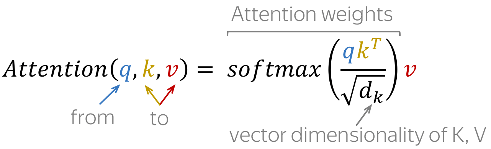

# Transformer Tutorial

## 模型架构

### transformer

整体的transformer是由左侧的encoder与右侧decoder组成的，本次实验只使用右侧的decoder结构。因此无需考虑encoder与decoder之间的cross attention机制（图中Decoder-encoder attention所指出的部分）。即在实现transformer decoder的block时，去掉图中右侧``Multi-Head Attention``的模块（图中Decoder-encoder attention所指出的部分），只保留``Masked Multi-Head Attention``, ``FeedForward``与``Add&Norm``即可。

注意：图中右侧decoder部分被灰色包裹住的部分（去掉``Multi-Head Attention``的模块）下文中统称为block，block会分为`attention`，`feedforward network`与`layerNorm and residual connections`三部分分别讲解。

transformer整体的工作流程如下动图所示：

<video src="README.assets/enc_dec_prob_idea.mp4"></video>

而我们使用的transformer decoder架构，即是去掉上动图中绿色的图像与文字后的状态。

### embedding

#### tokenizer

实验中用到的embedding是直接对所有的英文字母（a-z）进行tokenize化后得到的，需要在``train.py``中的``char_tokenizer``进行实现。

#### position embedding

对于transformer这类seq2seq模型，我们希望模型能够记住输入的每个token的位置，因此，在对文本进行编码之后，我们还需要创建一个用于记录每个embedding位置的位置向量，即position embedding。一般而言，position embedding分为absolute position embedding与relative position embedding，本实验中使用absolute position embedding即可。而absolute position embedding的实现方式一般有两种，使用高斯噪声生成一个随机的位置向量，并在之后的训练以及推断中保持不变（建议随模型一起保存）；另一种是使用三角函数来生成位置向量（https://kazemnejad.com/blog/transformer_architecture_positional_encoding/），具体方式如下：
$$
\left\{\begin{array}{l}
P E(\text { pos, } 2 i)=\sin \left(\text { pos } / 10000^{2 i / d_{\text {model }}}\right) \\
P E(\operatorname{pos}, 2 i+1)=\cos \left(\text { pos } / 10000^{2 i / d_{\text {model }}}\right)
\end{array}\right.
$$
其中，$pos$即是position，意为token在句中的位置，设句子长度为 $L$ ，则 $pos = 0,1,2,...,L-1$，$i$ 为向量的某一维度，若transformer decoder中的隐层状态向量维度为512，即$d_{model}=512$时，则 $i =0,1,2,3,4,..,254,255$ 

### attention (a part of block)

*Attention: At different steps, let a model "focus" on different parts of the input.*

注意力机制是transformer的一部分。在每个编码或者解码步骤中，它决定哪些输入部分更重要。在此设置中，encoder/decoder不必将整个输入压缩为单个向量，它为所有输入token提供表示。

#### cross-attention (between encoder and decoder)

示意图：

具体计算流程：

此处是计算decoder中的每个隐层状态与encoder中的各个隐层状态之间的相似度（atttention weights），在后续的2.3.1与2.3.2中的attention计算是encoder与decoder内部的隐层状态之间相互计算attention weights，因此被称为self-attention。

对于attention score，以下列出常见的几种计算方式（即上述**示意图**中的``attention function``）：

#### self-attention (encoder part)

自注意力是模型的关键组成部分之一。交叉注意力和自我注意力之间的区别在于自我注意力在相同性质的表示之间运行：例如，某个层中的所有编码器状态。 自注意力是模型中标记相互交互的部分。每个 token 通过注意力机制“看”句子中的其他 token，收集上下文，并更新之前对“self”的表示。

<video src="README.assets/encoder_self_attention.mp4"></video>

在transformer encoder中，每一个隐层状态（token的隐层表示），都会与当前层**除开自己之外**的所有隐层状态计算attention weights。

#### masked-self-attention (decoder part)

在解码器中，还有一种自我注意机制：它执行“查看以前的标记”功能。 在解码器中，self-attention与编码器中的有所不同。虽然编码器一次性接收所有token，每个token可以查看输入句子中的所有token，但在解码器中，我们一次生成一个token：在生成过程中，我们不知道将来会生成哪些token。所以，为了禁止解码器向前看，该模型使用了掩蔽的自注意力：未来的token被掩蔽掉了。因为我们无法知道未来发生什么。

<video src="README.assets/masked_self_attn.mp4"></video>

在transformer decoder中，每一个隐层状态（token的隐层表示），只会与当前层**自己当前位置之前**的所有隐层状态计算attention weights。

#### multihead-attention

通常，理解一个词在句子中的作用需要理解它与句子不同部分的关系。这不仅对处理输入的源句很重要，对生成目标句也很重要。例如，在某些语言中，主语定义动词变形，动词定义宾语的大小写，等等。即：每个词都是许多关系的一部分。

因此，我们必须让模型关注同一个词的不同的关系：这就是 Multi-Head Attention 背后的动机。多头注意力不是只有一个注意力机制，而是有几个独立工作的“头”。

形式上，这是作为几个注意力机制实现的，它们的结果是结合在一起的。

<video src="README.assets/multi_head.mp4"></video>

一般而言，多个注意力头向量最后会拼接在一起组成下一层的输入：

其形式化的计算公式如下：
$$
\begin{gathered}
\operatorname{MultiHead}(Q, K, V)=\operatorname{Concat}\left(\operatorname{head}_1, \ldots, \operatorname{head}_n\right) W_o \\
\operatorname{head}_i=\operatorname{Attention}\left(Q W_Q^i, K W_K^i, V W_V^i\right)
\end{gathered}
$$

#### query, key, value

我们在之前的章节讨论 cross-attention 中的计算流程时，$s_i$与$h_j$具体在计算attention时怎么表示呢，实际上是被拆分为了三个向量：$q, k, v$。

形式上，attention是通过查询键值来实现的。 self-attention中的每个输入 token 都会收到三个表示，对应于它可以扮演的角色：

- 查询query - asking for information;
- 键key - saying that it has some information;
- 值value - giving the information.

当token查看其他token时使用**查询** - 它正在寻找信息以更好地了解自己。**键**是响应查询的请求：它用于计算注意力权重。**值**用于计算注意力输出：它向查询它的其他token提供信息（即为其他token分配权重）

计算attention output的公式如下：

这里的attention output即2.3.0中最后的c值。

### feedforward network (a part of block)

除了attention之外，block模块中一个前馈神经网络（feedforward network），它由两层线性层以及之间的ReLU激活函数组成，形式化的表述如下：
$$
FFN(x) = \max(0,xW_1+b_1)W_2+b_2
$$
如何理解在attention之后加入FFN呢，一种比较直观的解释是：attention的作用在于观察其他token并且收集其信息，而FFN的作用在于思考并且处理这些信息。

### Layer Normalization and Residual Connections (a part of block)

#### Layer Normalization

图中的“Norm”或者“Add&Norm"表示Layer Normalization. 它能够独立的对输入的每个向量进行正则化，从而控制流入下一层的数据，其作用在于提高模型的表现以及收敛的稳定性。

Transformer中的Layer Normalization需要对每一个输入的token或者其对应的隐层状态向量（token embedding）进行正则化，LN层的$scale$与$bias$为其参数，是可训练的，而下图中的$\mu_k$与$\sigma_k$是根据输入的数据计算得到的。

#### Residual Connections

本质上就是ResNet中构建的数据旁路，其作用是保证梯度能够在层间传递的过程中不会消失，从而能够使得网络层数可以大幅度增加（保证深层网络的可训练性）。

在 Transformer 中，在每个注意力层和 FFN 块之后使用残差连接。在2.3.0的网络架构图中，残差连接显示为围绕块到黄色“Add & Norm”层的箭头。在“Add & Norm”部分，“Add”部分代表残差连接。

更多的细节可以参考：https://lena-voita.github.io/nlp_course/seq2seq_and_attention.html#transformer_intro
